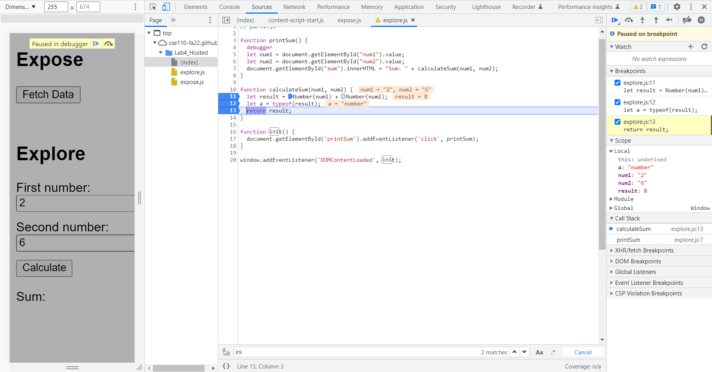

The bug is that it takes two strings, so it will concatnate two strings and
that will be the answer returned. However, two numbers should be added and 
the result should be a number type.

Turn the input to a number type, and that should be the solution.